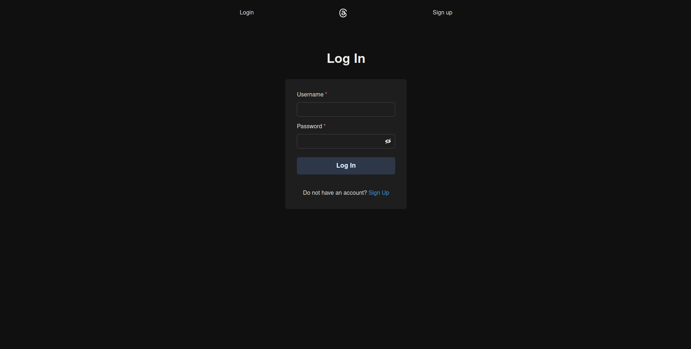
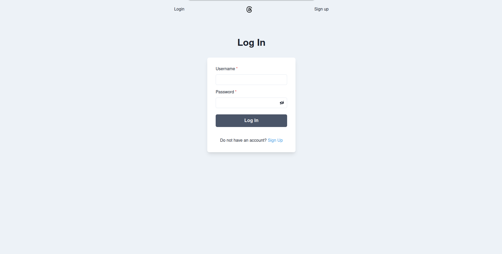
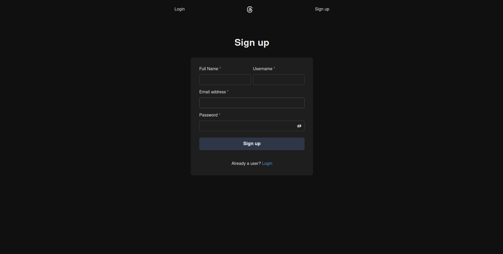
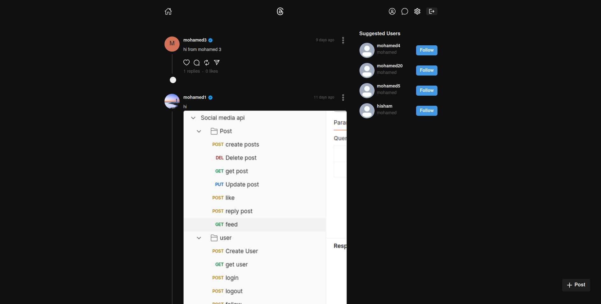
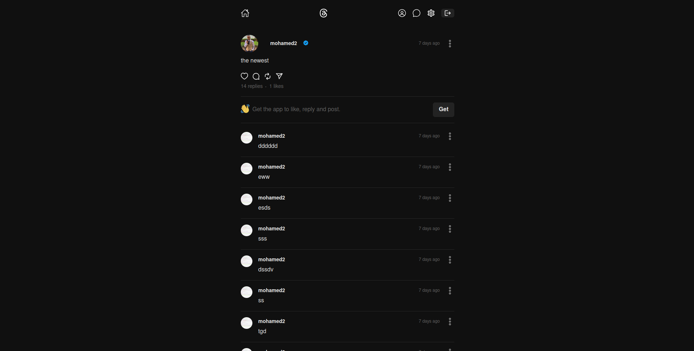
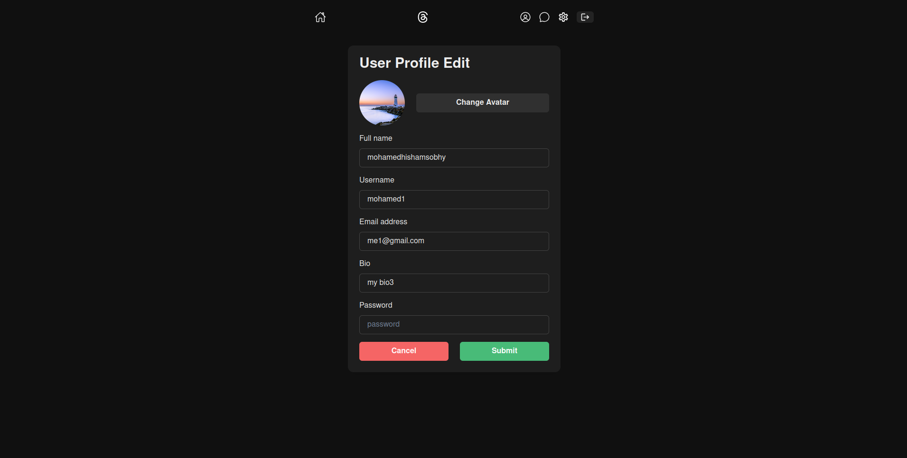
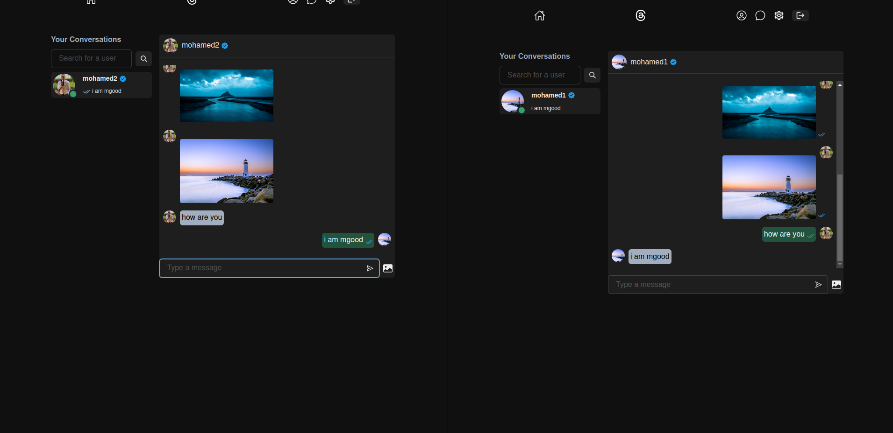

# Threads Clone 

Welcome to the **Threads Clone** repository! This project is a full-stack web application inspired by Threads, developed using the **MERN stack** (MongoDB, Express.js, React, Node.js).  

This application allows users to create accounts, share posts, like posts, reply posts, follow others, message others, freeze account, and engage in seamless social interactions, mimicking the functionality of Threads. 




## Features  
- **Authentication**: Sign up, log in, and manage your account securely.  
- **Post Creation**: Share text, images, or a combination of both.  
- **User Interactions**: Like, comment, and engage with posts.  
- **Follow System**: Follow and unfollow users to customize your feed.  
- **Chat System**: You can Chat with others by text and images with seen feature and notification soundes.
- **Responsive Design**: Fully optimized for both desktop and mobile devices.  
- **Profile Updater**: Edit all user information.  

## Tech Stack  
### Frontend  
- **React.js**: For building a dynamic and interactive user interface.  
- **Chackra UI**: For styling the application.  

### Backend  
- **Node.js**: For handling server-side logic.  
- **Express.js**: For creating RESTful APIs.  

### Database  
- **MongoDB**: For storing user and post data.  
- **Cloudinary**: For storing images.  

### Authentication  
- **JWT (JSON Web Tokens)**: For secure user authentication.  

## Installation  

1. **Clone the Repository**  
   ```bash  
   git clone https://github.com/mohamedhisham404/social_media.git  
   cd social_media  

2. **Put Your Own .env File**
    ```bash 
    touch .env
    ```
    #### then open it with your favourite text editor and put these values
    ```bash
    PORT = 3000
    MONGO_URI = XXX
    JWT_SECRET=XXX
    CLOUDINARY_CLOUD_NAME = XXX
    CLOUDINARY_API_KEY = XXX
    CLOUDINARY_API_SECRET = XXX
    ```
3. **Install The Dependencies**
    ```bash 
    npm run build
4. **Start The Application**   
    ```bash 
    npm start
    ```
## Future Improvements
- ### Add real-time notifications.
- ### Optimize performance and scalability..
- ### Add more functionalities to comments.
- ### improve chat experience.

## Screen Shots






